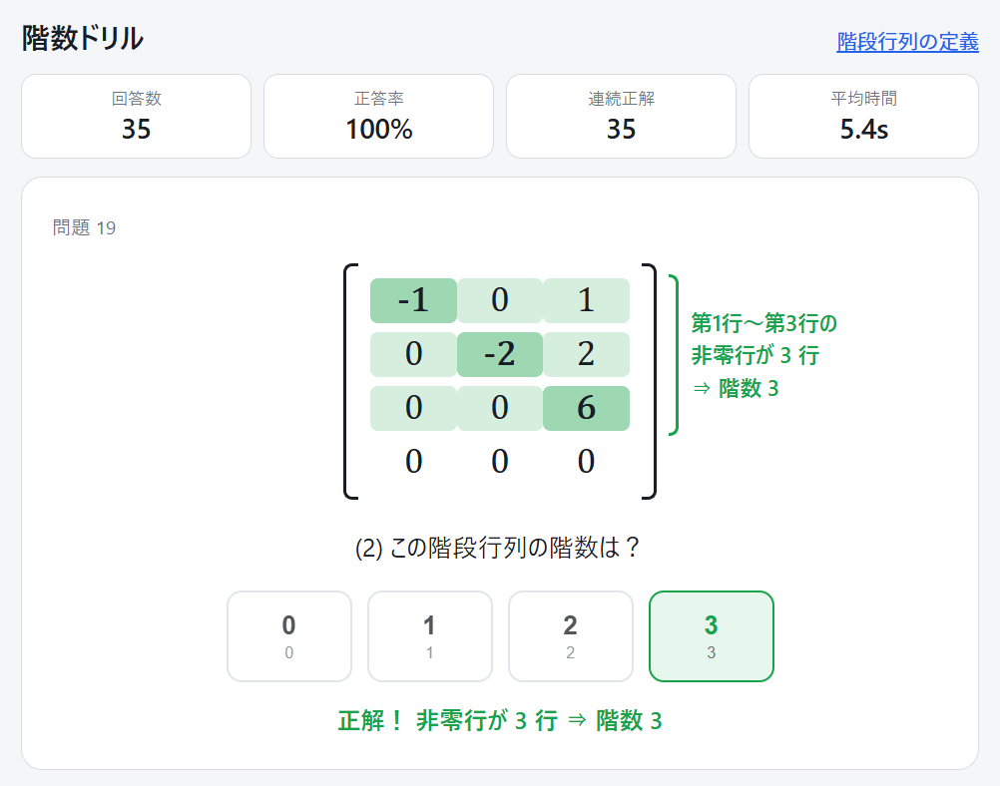

# 階数ドリル

線形代数の**階段行列（行階段形）**と**階数（rank）**の判定を、反復練習で速く正確にするためのWebアプリです。行列は問題データとしてあらかじめ用意されているのではなく、毎回動的に生成されます。



## 使い方

### Web

https://aike.github.io/rankdrill/

### ローカル実行

`index.html` をブラウザで開くだけで動きます。サーバーもビルドも不要です（外部リソースへの通信もありません）。

## 出題の流れ

1. 行列が1問ずつ表示されます（行数・列数とも 2～6 のランダム）。
2. **(1) この行列は階段行列ですか？** — 「はい / いいえ」のボタンで回答します。
   - 行列が階段行列でない場合は (2) へ進まず、次の問題（別の行列）に移ります。
   - 誤答した場合も、行列の**真の性質**に従って分岐します（階段行列なのに「いいえ」と答えた場合は、不正解の表示のあと (2) へ進みます）。
3. **(2) この階段行列の階数は？** — 0～min(行数, 列数) のボタンで回答し、次の問題へ移ります。

約7割が階段行列、約3割が階段行列でない行列として出題されます。

## 回答後の解説表示

- **(1) の回答後**：各行の主成分（左から最初の 0 でない成分）を濃い色、そこから右側を薄い色で塗ります。
  - 階段行列なら、色の付いた領域がそのまま階段状に見えます。
  - 階段行列でない場合は、条件が崩れている主成分を赤で強調し、理由を文章で示します（例：「第3行の主成分が上の行の主成分より右へ進んでいません」「第2行（零行）の下に非零行があります」）。
- **(2) の回答後**：非零行を緑で塗り、行列の右横にその範囲を囲むブラケットを表示して「第1行〜第3行の非零行が 3 行 ⇒ 階数 3」のように根拠を示します。

解説は正解時 1.4 秒・不正解時 3 秒表示したあと自動で次へ進みます。**Enter / Space** でスキップしてすぐ次へ進むこともできます。

## キーボード操作

マウスに手を伸ばさず連続回答できます。

| 場面 | キー | 動作 |
|---|---|---|
| (1) 階段行列の判定 | `Y` または `1` | はい |
| (1) 階段行列の判定 | `N` または `2` | いいえ |
| (2) 階数の回答 | `0`～`6` の数字キー | その階数を回答 |
| 解説の表示中 | `Enter` / `Space` | すぐ次へ進む |

## 統計表示

画面上部に以下をリアルタイム表示します。ページを再読み込みするとリセットされます。

- 回答数
- 正答率
- 連続正解数
- 1問あたりの平均回答時間

## 採用している定義

**階段行列（行階段形）**とは、次の2条件を満たす行列です（画面の「階段行列の定義」からも確認できます）。

1. 零ベクトルでない行はすべて零ベクトルの行より上にある
2. 各行の主成分（左から最初の 0 でない成分）は、上の行の主成分より真に右にある

主成分が 1 である必要はありません（簡約階段形ではなく行階段形の定義です）。階段行列の階数は非零行の個数に等しくなります。

## 問題生成の仕組み

- **階段行列**：階数 r（まれに 0 = 零行列）を選び、主成分の列を狭義単調増加に配置して生成します。成分は絶対値の小さい整数が出やすい分布です。
- **階段行列でない行列**：まず階段行列を生成し、それを意図的に崩して作ります。ぱっと見では階段行列に見える「ひっかけ」になります。崩し方は次の3種類：
  - 零行を非零行の間に挿入する
  - 隣り合う非零行を入れ替える（主成分の順序が崩れる）
  - 階段の左下（本来 0 の位置）に非零成分を置く

正誤の判定は生成ロジックとは独立に、表示中の行列の成分から直接 `isEchelon()` で判定します。生成器・判定器・階数は、独立実装のガウス消去との突き合わせを含むランダムテスト（数十万ケース）で検証済みです。

## ファイル構成

```
index.html   アプリ本体（HTML / CSS / JavaScript すべてを含む単一ファイル）
README.md    このファイル
```

## LICENSE

MIT
